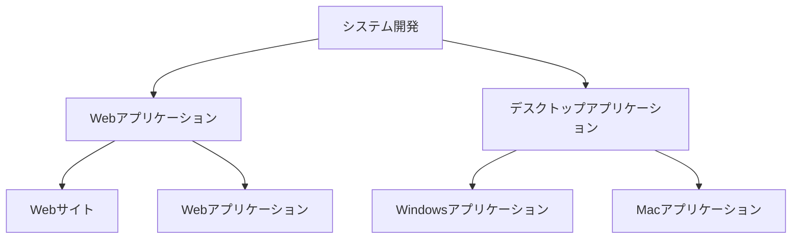

# 株式会社Gerundaについて 

## 会社概要

| 項目    | 内容                                             |
|-------|------------------------------------------------|
| 会社名   | 株式会社Gerunda(Gerunda, Inc.)                     |
| 郵便番号  | 104-0061                                       |
| 住所    | 東京都中央区銀座1-12-4 N&E BLD.7階                      |
| 代表取締役 | 齋藤幹大                                           |
| 設立日   | 2023年03月13日                                    |
| 資本金   | 1,000,000円                                     |
| 事業内容  | 各種システム、ソフトウェア等の企画、開発、制作、配信、保守、管理、運営、販売及びそれらの受託 |

## 事業内容

## ホームページ

[https://gerunda.co.jp/](https://gerunda.co.jp/)